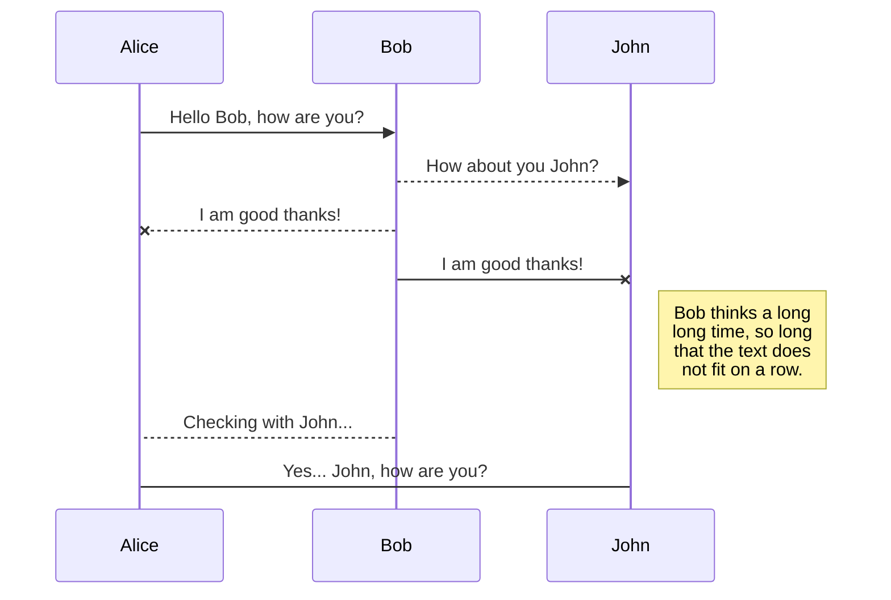
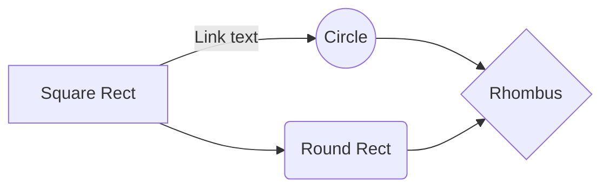

# AR+Tensorflow!

Greetings! This is my github repo for handling AR/Computer Vision with Tensorflow. My intention is to use this to document my progress with learning tensorflow on Github so I can get more dark green squares, since all my other work involves things with API keys that I don't want to get out, and I feel it's a shame that I spent 3 years learning my favorite skill WebXR and have no green squares to show for it. I'm excited to show green squares for my progress learning tensorflow and machine learning in general, and maybe having a public repo will help me get better at doing open source git work as well. If you ever find yourself stumbling across and reading this, follow me on twitter @mathyouf and let me know why.

(below are syntax templates im saving for when I need them)

# Header

Not bold / **BOLD!**

## Subheader

|       | Column 1 | Column 2  |
| ----- | -------- | --------- |
| Row 1 | text     | more text |

$$
\Gamma(z) = \int_0^\infty t^{z-1}e^{-t}dt\,.
$$

> Quote [hyperlink](google.com).

And this will produce a flow chart:

